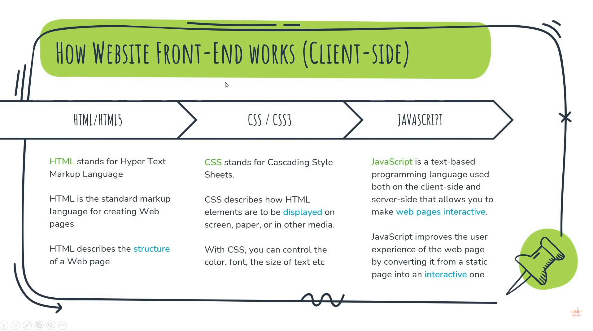
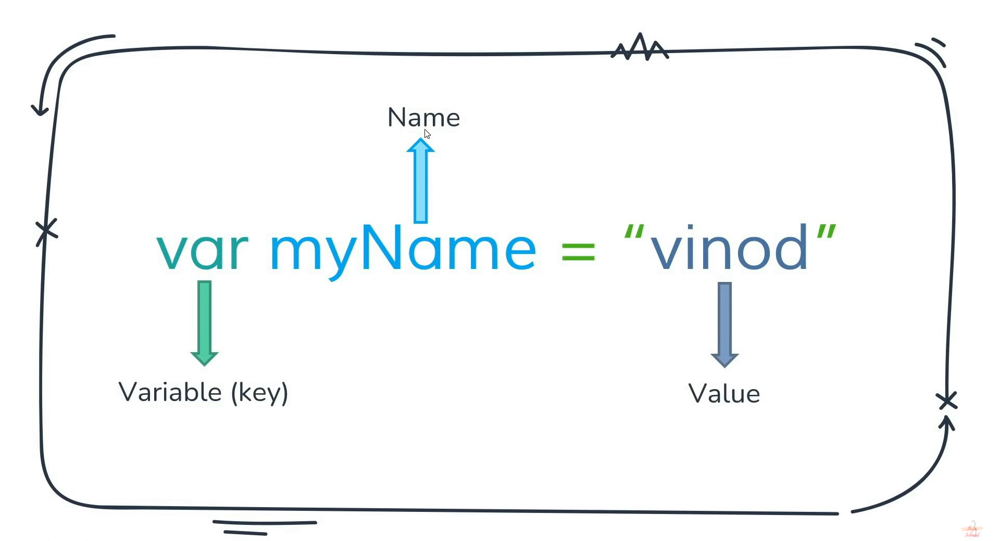
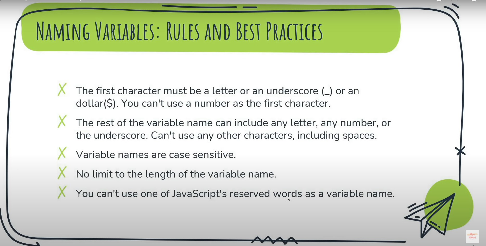
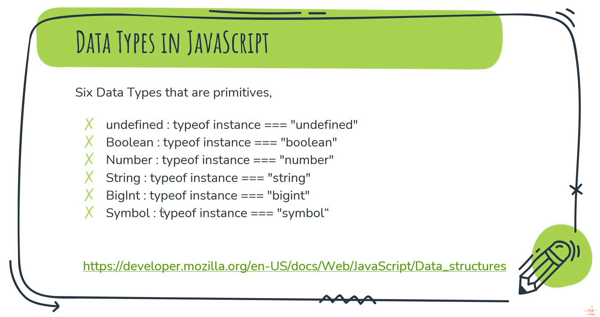
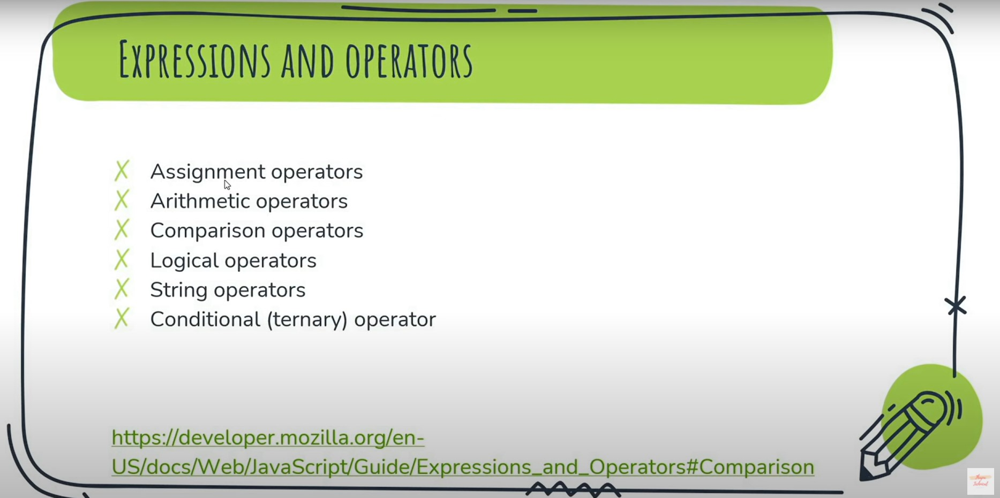
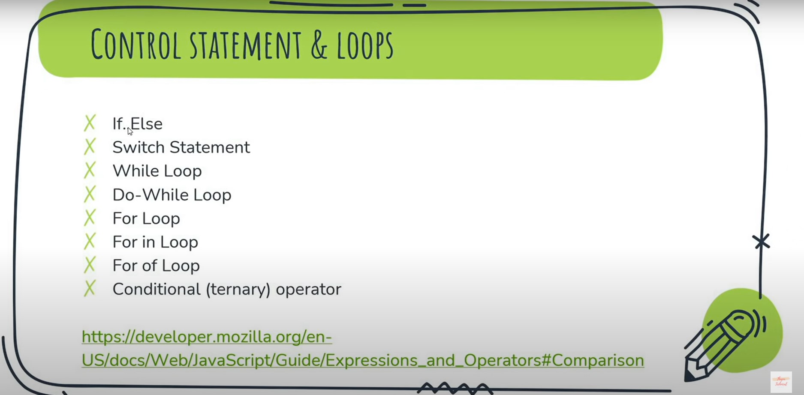
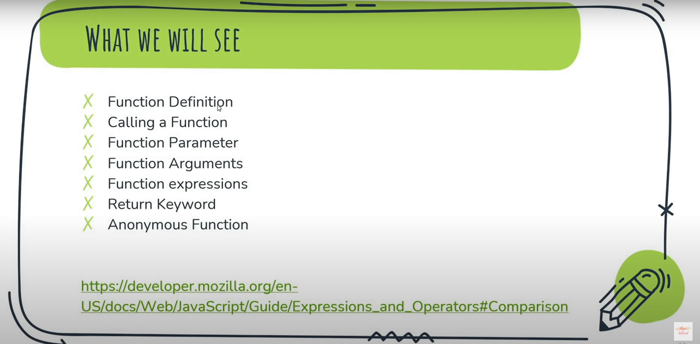
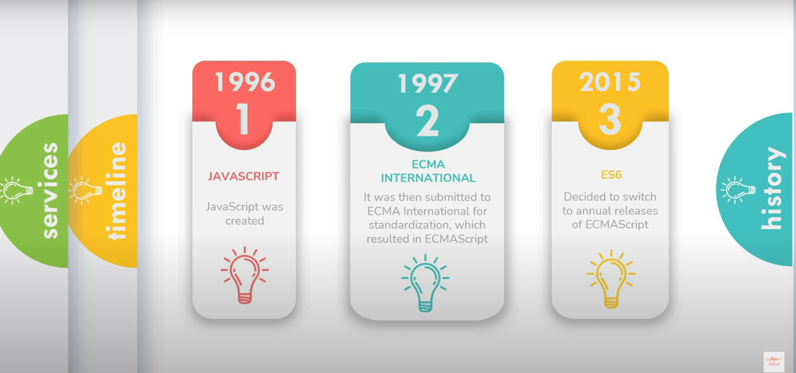
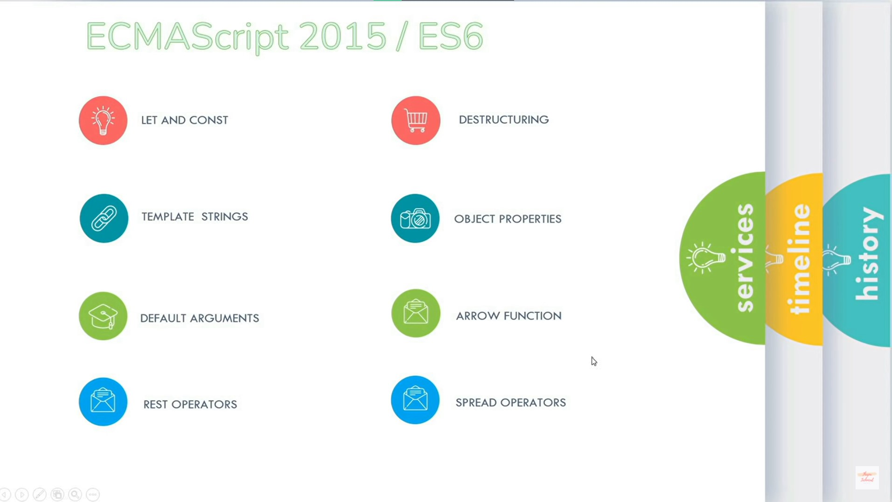

# **CODE WITH HARRY**
## What is JavaScript?

- JavaScript is a client side scripting language.
- It is used to make web pages alive.
- It is used to programmatically perform actions within the page.
- When JavaScript was created, it was initially called “LiveScript”.
- But Java was a very popular language at that time, so it was decided that positioning a language as a “younger brother” of Java would help.

## What JavaScript can do?

- JavaScript can execute not only in the browser, but also on the server.
- We will use JavaScript as a client as well as server side language.
- JavaScript has evolved greatly as a language and is now used to perform a wide variety of tasks. 

## What Can In-Browser JavaScript Do?

If JavaScripts are used in any websites, then it should not be given any low level CPU permissions like switching off the CPU etc. That is why JavaScript is made with extremely safe permissions that does not have any permission to access low level CPU usage. 

1. JavaScript can add new HTML and change existing HTML from DOM.
2. It can even react to any events (actions).
3. It can also manage the AJAX requests (GET or POST request)
4. JavaScript can **get** and **set** cookies and use local storage.

## What Can’t In-Browser JavaScript Do?

1. JavaScript cannot read or write to and from computer hard disk without user permissions. 
2. The browser does not allow the JavaScript of any website to collect the AJAX information of the other website because it generates the error of  same origin policy.
3. To summarize, JavaScript can only access the permitted resources but cannot access your documents on personal computers. 

These strict policies are developed to make sure that your computer is safe.

## What Makes JavaScript a Unique language?

- The most important thing that makes it a unique language is, it has a complete integration of HTML and CSS. They provide it with a lot of extra support.
- Also it provides the use of simple APIs (Application Programming Interface).
- It also supports the major modern browsers which are enabled by default. If you turn off the feature of JavaScript in the browser, you cannot access any website.

### Versions of JavaScript

JavaScript is such an important language that it requires substantial updates to maintain its different versions. The ECMA is a standard maintained for any of the scripting languages that pushes for new updates. The ECMA was first launched in 1997.

So I believe you must have understood the basic concept of JavaScript. We will learn more about it in the upcoming tutorials. Till then stay tuned with the tutorials.
<hr>
<hr>


# [**THAPA TECHNICAL**](https://youtu.be/KGkiIBTq0y0)

##  <u>**What is JavaScript ?**</u> 
- Improves the user experience of the web page by converting it from a static page into an interactive one.
- JavaScript adds behaviour to web pages.

<br>

### **How website FRONTEND works?**


<br>

## **1. Values and Variables in JavaScript**


```js
var myName = 'Nidhi Kumari';
var myAge = 26;
console.log(myName,myAge);
```

<br>

## **2. Data Types in JavaScript**

```js
var myName="Nidhi Kumari";
console.log(myName);
console.log(typeof(myName));
console.log();
var myAge = 26;
console.log(myAge);
console.log(typeof(myAge));
console.log();
var iAmNidhi = true;
console.log(iAmNidhi);
console.log(typeof(iAmNidhi));
console.log("---------------------");
// DataTypes Practice
console.log( 10 + "20");
console.log( 9 - "5");//bug
console.log( "Java " + "Script"); 
console.log( " " - " ");//gives 0
console.log( " " + " ");
console.log( " " + "0");
console.log( "Nidhi" - "Kumari"); //NaN-Not a Number
console.log( true + true);
console.log( true + false);
console.log( false + true);
console.log( false - true);
```
####  <u>Ques-1 🙋</u> - Difference between null and undefined ?
- Explaination using eg
```js
var iAmUseless = null;
console.log(iAmUseless);//null
var iAmStandBy;
console.log(iAmStandBy);//undefined
console.log(typeof(iAmUseless));//********2nd javascript bug*********
var iAmStandBy;
console.log(typeof(iAmStandBy));
```
####  <u>Ques-2 🙋</u> - What is NaN ?
- NaN is a property of the global object.
- In other words, it is a variable in global scope.
- The initial value of NaN is Not-A-Number
```
var myPhoneNumber = 9876543210;
var myName = "thapa technical";

console.log(myPhoneNumber);
console.log(myName);
console.log(isNaN(myPhoneNumber));
console.log(isNaN(myName));

if(isNaN(myName)){
    console.log("plz enter valid phone no");
}


// NaN Practice 🤯

NaN === NaN;        
Number.NaN === NaN; 
isNaN(NaN);         
isNaN(Number.NaN);  
Number.isNaN(NaN);
console.log(NaN === NaN);
console.log(Number.NaN === NaN);
console.log(isNaN(NaN));
console.log(Number.isNaN(NaN));
console.log(isNaN(Number.NaN));

```


<br>

## **3.  Arithmetic operators in JavaScript**



### **1️⃣Assignment Operator**
- An assignment operator assigns a value to its left operand based on the value of its right operand. 
- The simple assignment operator is equal (=)

### **2️⃣Arithmetic operators**
- An arithmetic operator takes numerical values (either literals or variables) as their operands and returns a single numerical value.

### Increment and Decrement operator
- Operator: x++ or ++x or x-- or --x
- If used postfix, with operator after operand (for example, x++),  the increment operator increments and returns the value before incrementing.

```
 var num = 15;
 var newNum = num-- + 5;
 console.log(num);
 console.log(newNum);
```
- Postfix increment operator means the expression is evaluated first using the original value of the variable and then the variable is incremented(increased).


- If used prefix, with operator before operand (for example, ++x),  the increment operator increments and returns the value after incrementing.

```
 var num = 15;
 var newNum = --num + 5; 
 console.log(num);
 console.log(newNum);
```

### **3️⃣Comparison operators**
- A comparison operator compares its operands and returns a logical value based on whether the comparison is true.

```
var a=30;
var b=10;
console.log(a==b);
console.log(a!=b);
console.log(a<b);
console.log(a>b);
console.log(a<=b);
console.log(a>=b);
```
### **4️⃣ Logical operators**
- Logical operators are typically used with Boolean (logical) values, when they are, they return a Boolean value.


### Logical AND (&&)
- The logical AND (&&) operator (logical conjunction) for a set of operands is true if and only if one or more of its expressions are true.

```
var a = 30;
var b = -20;
console.log(a > b && b > -50 && b < 0);
console.log(!true);
```

### Logical OR (||)
- The logical OR (||) operator (logical disjunction) for a set of operands is true if and only if one or more of its expressions are true.
```
var a = 30;
var b = -20;
console.log((a < b) || (b > 0) || (b > 0));
console.log(!true);
```

### Logical NOT (!)
- The logical NOT (!) operator (logical complement, negation) akes truth to falsity and vice versa.
```
var a = 30;
var b = -20;
console.log(!((a>0) || (b<0)));
console.log(!true);
```

### **5️⃣ String Concatenation(operators)**
- The concatenation operator (+) concatenates two string values together, returning another string that is the union of the two operand strings.

```
 console.log("Hello World");

 console.log("hello " +  "world");

 var myName = "vinod";

 console.log(myName + " thapa");
 console.log(myName + " bahadur");
 console.log(myName + " bahadur Thapa");
```

####  <u>Ques-1 🙋</u> - What will be the output of 3**3  ?
- console.log(9**2); // 9*9
- console.log(10 ** -1); //1/10


####  <u>Ques-2 🙋</u> - What will be the output, when we add a number and a string ?
- console.log(5 + "thapa");

####  <u>Ques-3 🙋</u> - Write a program to swap two numbers ?

```
var a = 5;
var b = 10;
output b=5; a=10

 var c = b; //c = 10
 b = a; // b = 5;
 a = c;

 console.log("the value of a is " + a);
 console.log("the value of b is " + b);
```

####  <u>Ques-4 🙋</u> - Write a program to swap two numbers without using third variable ? 
```
 var a = 5;
 var b = 10;

 output b=5; a=10

 a = a + b; // a = 15
 b = a - b; // b = 5; 
 a = a - b; // a = 10;

 console.log("the value of a is " + a);
 console.log("the value of b is " + b);
```
####  <u>Ques-5 🙋</u> - What is the Difference between == vs === ?

- == check only value and === checks value and datatype of that value.

```
 var num1 = 5;
 var num2 = '5';

 console.log(typeof(num1));
 console.log(typeof(num2));

 console.log(num1 == num2 );

 var num1 = 5;
 var num2 = '5';

 console.log(typeof(num1));
 console.log(typeof(num2));
 console.log(num2);

 console.log(num1 === num2 );
```
## **4.  Control Statement**



### **1️⃣If...Else**
- The if statement executes a statement if a specified condition is truth. 
- If the condition is false, another statement can be executed.

```
var tomr = 'sunny';

if(tomr == 'rain'){
console.log('take a raincoat');
}
else{
console.log('No need to take a raincoat');
}
```
####  <u>Ques-1 🙋</u> - write a program that works out whether if a given year is a leap year or not?

- A normal year has 365 days, leap years have 366, with an extra day in February.
```
var year = 2020;
debugger;
if(year % 4 === 0){
if(year % 100 === 0){
if(year % 400 === 0){
console.log("The year " + year + " is a leap year");
}else{
console.log("The year " + year + " is not a leap year");
 }
}else{
console.log("The year " + year + " is a leap year");
}
}else{
console.log("The year " + year + " is not a leap year");
}
```

####  <u>Ques-2 🙋</u> -What istruthy and falsy values inJavascript?
- we have total 5 falsy values injavascript
-  👉 0,"",undefined,null,NaN,false** is false anyway

```
if(score = 5){
console.log("OMG, we loss the game 😭");
}
else{
console.log("Yay, We won the game 😀");
}
```

### **2️⃣Conditional (ternary) operator**
- he conditional (ternary) operator is the only JavaScript operator that takes three operands
```
var age = 17;
if(age >= 18){
console.log("you are eligible to vote");
}else{
console.log("you are not eligible to vote");
}

var age = 18;
console.log((age >= 18) ? "you can vote" : "you can't vote");
```

### **3️⃣ switch Statement**
-  Evaluates an expression, matching the expression's value to a case clause, and executes statements associated with that case.

### 1st without break statment 
<br>

####  <u>Ques-3 🙋</u> -Find the Area of circle, triangle and rectangle?
```
ar area = "square" ;
var PI = 3.142, l=5, b=4, r=3;

if(area == "circle"){
  console.log("the area of the circle is : " + PI*r**2);
}else if(area == "triangle"){
  console.log("the area of the triangle is : " + (l*b)/2);
}else if(area == "rectangle"){
  console.log("the area of the rectangle is : " + (l*b));
}else{
  console.log("please enter valid data");
}

var area = "dsfsad" ;
var PI = 3.142, l=5, b=4, r=3;

switch(area){
  case 'circle': 
    console.log("the area of the circle is : " + PI*r**2);
    break;

  case 'triangle':
    console.log("the area of the triangle is : " + (l*b)/2);
    break;

  case 'rectangle':
    console.log("the area of the rectangle is : " + (l*b));
    break;

  default:
    console.log("please enter valid data");
}   
```
### Break
- Terminates the current loop, switch, or label statement and transfers program control to the statement following the terminated statement.


### Continue
- Terminates execution of the statements in the current iteration of the current or labeled loop, and continues execution of the loop with the next iteration.


### **4️⃣ While Loop Statement**

- The while statement creates a loop that executes a specified statement 
as long as the test condition evaluates to true. 
```
var num=20;
block scope 
while(num <= 10){
console.log(num); //infinte loop
num++;
}
```

### **5️⃣ Do-While Loop Statement**
```
var num = 20;
do{
debugger;
console.log(num); //infinte loop
num++;
}while(num <= 10);
```

### **6️⃣ For Loop**
```
for(var num = 0; num <= 10; num++){
debugger;
console.log(num);
}
```

####  <u>Ques-4 🙋</u> -JavaScript program to print table for given number (8)?
```
output :  8 * 1 = 8 
          8 * 2 = 16(8*2)
           => 8 * 10 = 80
```
<br>

```
for(var num = 1; num<= 10; num++){
var tableOf = 12;  
console.log(tableOf + " * " + num + " = " + tableOf * num);
}
```


## **4.  Functions**



### **1️⃣Function Definition**
- A function definition (also called a function declaration, or function statement) consists of the function keyword, followed by:
- The name of the function.
- A list of parameters to the function, enclosed in parentheses and separated by commas.
- The JavaScript statements that define the function, enclosed in curly brackets, {...}.

```
var a = 10;
var b = 20;
var sum = a+b;
console.log(sum);


function sum(){
var a = 10, b = 40;
var total = a+b;
console.log(total);
}
```

### **2️⃣Calling functions**
- Defining a function does not execute it.
- A JavaScript function is executed when "something" invokes it (calls it).

```
function sum(){
var a = 10, b = 40;
var total = a+b;
console.log(total);
}

sum();
```

### **3️⃣ Function Parameter vs Function Arguments**
- Function parameters are the names listed in the function's definition. 
- Function arguments are the real values passed to the function.

```
function sum(a,b){
var total = a+b;
console.log(total);
}

sum();
sum(20,30);
sum(50,50);
sum(5,6)
```

####  <u>Ques-1 🙋</u> -Why Functions ?
- You can reuse code: Define the code once, and use it many times.
- You can use the same code many times with different arguments, to produce different results.

 OR

- A function is a group of reusable code which can be called anywhere in your program. This eliminates the need of writing the same code again and again.

- DRY => do not repeat yourself

### **4️⃣ Function expressions**
- "Function expressions simply means create a function and put it into the variable "
```
function sum(a,b){
var total = a+b;
console.log(total);
}

var funExp = sum(5,15);

```

### **5️⃣ Return Keyword**
- When JavaScript reaches a return statement, 
- the function will stop executing.
- Functions often compute a return value.
- The return value is "returned" back to the "caller"

```
function sum(a,b){
return total = a+b;
}

var funExp = sum(5,25);

console.log('the sum of two no is ' + funExp );
```

### **6️⃣ Anonymous Function**
- A function expression is similar to and has the same syntax as a function declaration One can define "named" function expressions (where the name of the expression might be used in the call stack for example) or "anonymous" function expressions.

```
var funExp = function(a,b){
return total = a+b;
}

var sum = funExp(15,15);
var sum1 = funExp(20,15);

console.log(sum > sum1 );
```

<hr>
<hr>

# [**ECMA SCRIPT / ES6**](https://youtu.be/KGkiIBTq0y0?t=14472)




<br>
<br>

### **1️⃣ LET VS CONST  vs  VAR**

```
var myName = "thapa technical";
console.log(myName);

myName = "vinod thapa";
console.log(myName);

let myName = "thapa technical";
console.log(myName);

myName = "vinod thapa";
console.log(myName);


const myName = "thapa technical";
console.log(myName);

myName = "vinod thapa";
console.log(myName);


function biodata() {
  const myFirstName = "Vinod";
  console.log(myFirstName);

  if(true){
    const myLastName = "thapa";
  }

  // console.log('innerOuter ' + myLastName);
}

console.log(myFirstName);

biodata();

```
####  <u>Ques-3 🙋</u> - What is difference between var vs let vs const  ?
- var is Function scope 
- let and const are Block Scope 


### **2️⃣ Template literals (Template strings)**
```
JavaScript program to print table for given number (8)?

output :  8 * 1 = 8 
          8 * 2 = 16(8*2)
         => 8 * 10 = 80

for(let num = 1; num<= 10; num++){
    let tableOf = 12;  
  // console.log(tableOf + " * " + num + " = " + tableOf * num);
  console.log( ` ${tableOf} * ${num} = ${tableOf * num}` );
}
```


 ### **3️⃣  Default Parameters**
 - Default function parameters allownamed parameters to be 
initialized with default values if no value or undefined is passed.

```
function mult(a,b=5){
  return a*b;
}

console.log(mult(3));
```


 ### **4️⃣ Destructuring in ES6**
 - The destructuring assignment syntax is a JavaScript expression that makes it possible to unpack values from arrays, or properties from objects, into distinct variables.

 ### ➡ Array Destructuring  🏁
 ```
  const myBioData = ['vinod', 'thapa', 26];

  let myFName = myBioData[0];
  let myLName = myBioData[1];
  let myAge = myBioData[2];
  
let [myFName,myAge, myLName] = myBioData;
console.log(myAge);

  we can add values too 
  
  let [myFName,myLName,myAge, myDegree="MCS"] = myBioData;
  console.log(myDegree);
  ```
### ➡ Object destructuring 🏁
```
  const myBioData = {
    myFname : 'vinod',
    myLname : 'thapa',
    myAge : 26
  }

  let age = myBioData.age;
  let myFname = myBioData.myFname;

  let {myFname,myLname,myAge, myDegree="MCS"} = myBioData;
  console.log(myLname);
  ```

### **5️⃣ Object Properties**

### ➡ we can now use Dynamic Properties 
```
let myName = "vinod";
const myBio = {
[myName] : "hello how are you?",
[20 + 6] : "is my age"
}
console.log(myBio);
```
### ➡ no need to write key and value, if both are same 
```

  let myName = "vinod thapa";
  let myAge = 26;

  const myBio = {myName,myAge}

  console.log(myBio);
  ```


### **6️⃣ Fat Arror Function** 

   ```
👻 Normal Way of writing Function  

console.log(sum()); 

function sum() {
  let a = 5; b = 6;
  let sum = a+b;
 return `the sum of the two number is ${sum}`;
}

👻 How to convert in into Fat Arrow Function 

const sum = () => `the sum of the two number is ${(a=5)+(b=6)}`;

console.log(sum()); 
```


### **7️⃣Spread Operator**
```
const colors = ['red', 'green', 'blue', 'white', 'pink'];

const myColors = ['red', 'green', 'blue', 'white','pink', 'yellow', 'black'];
// // 2nd time add one more color on top and tell we need to write it again 
// // on myColor array too 

const MyFavColors = [ ...colors, 'yellow', 'black'];

console.log(MyFavColors);
```

### ES7 features 
```
//1: array include 
const colors = ['red', 'green', 'blue', 'white', 'pink'];
const isPresent = colors.includes('purple');
console.log(isPresent);
// 2: **
console.log(2**3); 
```
### ES8 Features
```
String padding
Object.values()
Object.entries()

const message = "my name is vinod";
console.log(message);
console.log(message.padStart(5));
console.log(message.padEnd(10));


const person = { name: 'Fred', age: 87 };

// // console.log( Object.values(person) );
const arrObj =  Object.entries(person);
console.log(Object.fromEntries(arrObj));
```

### ES2018
```
const person = { name: 'Fred', age: 87, degree : "mcs" };
const sPerson = { ...person };

console.log(person);
console.log(sPerson);
```

### ES2019
 ```
 Array.prototype.{flat,flatMap}
Object.fromEntries()
```

### ES2020
```
#1: BigInt

let oldNum = Number.MAX_SAFE_INTEGER;
// console.log(oldNum);
// console.log( 9007199254740991n + 12n );
const newNum = 9007199254740991n + 12n;

console.log(newNum);
console.log(typeof newNum);


const foo = null ?? 'default string';
console.log(foo)
```

### ES2014
 ```
"use strict";

x = 3.14; 
console.log(x);
```


